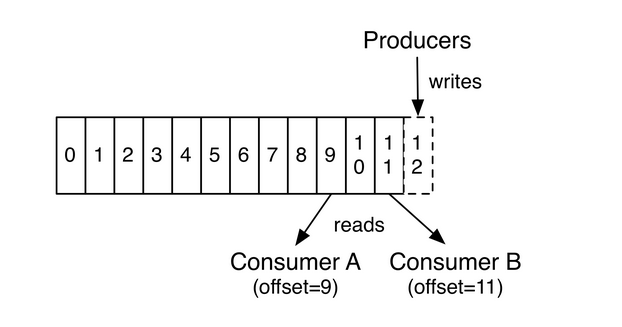

## Kafka官方文档翻译

* 基于kafka1.0.0版本
* [官方文档](https://kafka.apache.org/documentation/)

**Apache Kafka是一个分布式的流式的平台**

一个流式的平台需具备三个关键能力
1. 它能让你发布、订阅流消息(在这一点上和传统的消息队列或者企业消息系统类似)。
2. 它能以一种容错的方式去存储消息。
3. 它能按消息出现的顺序来处理消息。

Kafka的两个比较广泛的应用：
1. 构建实时的流式的数据通道从各个系统或者应用之间获取数据。
2. 构建实时的流式的应用用于处理流试的数据。

Kafka是如何实现这些的呢？

1. Kafka运行在由一台或者多台机器组成的集群中。
2. Kafka cluster将流式的数据存储在各个Topic中。
3. 每条消息(record)由一个key、一个value及一个timestamp组成。

### Kafka四个核心API

### Producer API
作用: 将消息(record)发布到一个或者多个Topic中。

### Consumer API
作用: 从一个或者多个Topic中订阅消息并消费它们。

### Streams API
作用: 允许一个应用作为流处理器，将一个或者多个Topic中的信息作为输入流，经过一系列的处理，输出到新的输出流的一个或者多个Topic中。

### Connector API
作用: 构建和运行可复用的producers 或者 consumers，将Kafka topics连接到已存在的应用或者数据系统，如：连接到关系型数据库捕获所有的变动并将其存入数据库。

在Kafka中客户端与服务器端的通信是通过简单、高效、语言无关的TCP协议的完成。

### Topic

Topic骨架图

一个Topic是一个消息的分类。Kafka里面的Topics总是有多个订阅者，一个topic可能用0个、1个或者多个consumer。

一个Topic有一个或者多个partition(分区)组成。

每一个partition(分区)一个有序的、不可变的消息队列(一个不断追加的结构化的提交日志)

在分区中的每条消息都会被分配一个有序的、唯一的id叫做offset，用于在分区中标识每一条消息。

Kafka cluster保留所有Producer发布过来的消息, 不管消息有没有被消费都会保留。可以通过配置保留策略来控制消息的失效时间。
例如：如果保留策略设置为2天，所有在这两条内的消息都会被保留，2天之后消息将会被丢弃以释放内存空间。

Kafka用于长期的存储数据是没有任何问题的。

### 消息消费图示：

实际上，每个consumer只维护一个元数据信息就是：**offset**，通过这个值你可以以任意的顺序去消费消息。例如：你可以重置offset再次消费已经消费过的消息，
你也可以跳过前几条消息、或者从最近的消息开始消费。

这意味着Kafka的consumers可以很轻易的进入或者退出partition(分区)而不会影响整个集群及其他消费者

日志进行分区有几个目的：
1. 日志大小可以超过单台机器的最大容量大小， 每个日志分成不同的分区存放在不同的服务器上，由于一个Topic可以包含多个分区所以它可以处理任意大小的数据。
2.分区是进行并行处理的基本单元。

### Distribution 分布式
各个分区的日志发布在Kafka cluster的不同机器上，每个分区在多个机器上配置成复制(replicated)成多分，为了容错(fault tolerance).

The partitions of the log are distributed over the servers in the Kafka cluster
with each server handling data and requests for a share of the partitions.
Each partition is replicated across a configurable number of servers for fault tolerance.

每个分区(partition)都有一个leader服务器一级0个或者多个follower服务器。leader服务器负责处理所有的读请求和写请求，follower服务器从leader服务器将请求复制过来。

如果leader服务器宕机了，会自动从follower服务器选出一个新的leader。

每台服务器都作为部分分区的leader也作为其他分区的follower，这样就达到了很好的负载均衡。

